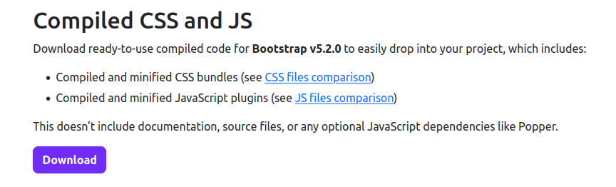

# Flask: webapp

Voltar à [Página inicial](../../README.md).

Neste markdown irei documentar o curso "Flask: criando um webapp" da Alura enquanto realizo ele.

O projeto em que serão aplicados os conceitos estão nesta pasta Flask_Criando_um_webapp. 

Para não nos perdemos entre as modificações no projeto e esta documentação, todo commmit dado será reportado aqui. A ideia é que tal documento siga o curso de forma linear.

## Preparando o ambiente

Versões utilizadas

- Python: 3.10.4
- Flask: 2.0.2
## Primeiros passos

Instale um ambiente virtual 
```
python3 -m venv ./venv
```
Para ativar 
```
source /home/carlos/Documentos/Apostila_Tech/Apostila_Tech/Python_TDD/venv/bin/activate
```
Para instalar os requirementos rode
```
pip3 install -r requirements.txt 
```

Aqui darei o primeiro commit com nome "primeiros passos para Flask: webapp".

## Criando a primeira pagina

Cire um arquivo jogoteca.py e insira
```
from flask import Flask

app = Flask(__name__)

@app.route('/inicio')
def ola():
    return '<h1>Olá Mundo!</h1>'

app.run()
```
Rodando esse arquivo já temos a nossa primeira pagina em http://127.0.0.1:5000/inicio. Por enquanto 
nossa pagina apenas mostra a mensagem "Olá mundo", como podemos renderizar um código html mais elaborado? Crie uma pasta com nome templates, e dentro um arquivo lista.html com o seguinte código
```
<!DOCTYPE html>
<html>
  <head>
    <meta charset="utf-8">
    <meta name="viewport" content="width=device-width, initial-scale=1">
    <title>Jogoteca</title>
  </head>
  <body>
    <div class="container">
        <div class="page-header">
            <h1>{{ titulo }}</h1>
        </div>
        <table class="table table-striped table-responsive table-bordered">
            <thead class="thead-default">
                <tr>
                    <th>Nome</th>
                </tr>
            </thead>
            <tbody>
                <tr>
                    <td>God of War</td>
                </tr>
                <tr>
                    <td>Skyrim</td>
                </tr>
                <tr>
                    <td>Valorant</td>
                </tr>
            </tbody>
        </table>
    </div>
  </body>
</html>
```
Para conseguirmos renderizar tal código devemos importar a biblioteca "render_template" e 
dar "return render_template('lista.html')"
```
from flask import Flask, render_template

app = Flask(__name__)

@app.route('/inicio')
def ola():
    return render_template('lista.html')

app.run()
```

Darei um commit com nome "primeiro webapp".

## Conteúdos dinâmicos

Substitua  em **lista.html** o código "<title>Jogoteca</title>" por  "<title>{{ titulo }}</title>"
e em **jogoteca.py**  deixe da seguinte forma:
```
from flask import Flask, render_template

app = Flask(__name__)

@app.route('/inicio')
def ola():
    return render_template('lista.html', titulo='Jogos')

app.run()
```
Note agora que o título da nossa pagina http://127.0.0.1:5000/inicio é 'Jogos'. No próximo passo deixaremos nossa página ainda mais dinâmica.

Agora deixe o arquivo **jogoteca.py** da seguinte forma
```
from flask import Flask, render_template

app = Flask(__name__)

@app.route('/inicio')
def ola():
    lista = ['Tetris', 'Skyrim', 'Crash']
    return render_template('lista.html', titulo='Jogos', jogos=lista)

app.run()
```

E **lista.html** substitua 
```
    <tbody>
        <tr>
            <td>God of War</td>
        </tr>
        <tr>
            <td>Skyrim</td>
        </tr>
        <tr>
            <td>Valorant</td>
        </tr>
    </tbody>
```
Por 
```
 <tbody>
    
                <tr>
                    <td>{{ jogo }}</td>
                </tr>

</tbody>
```
Note então que estamos mostrando a lista '['Tetris', 'Skyrim', 'Crash']' dinamicamente. Vamos utilizar
orientação a objetos agora. Crie a classe **Jogo** e instacie três objetos que serão enviados para o lista.html por meio de uma lista, como abaixo: 

```
from flask import Flask, render_template

app = Flask(__name__)

class Jogo:
    def __init__(self, nome, categoria, console):
        self.nome = nome
        self.categoria = categoria
        self.console = console

@app.route('/inicio')
def ola():
    jogo1 = Jogo('Tetris', 'Puzzle', 'Atari')
    jogo2 = Jogo('God of War', 'Hack n Slash', 'PS2')
    jogo3 = Jogo('Mortal Kombat', 'Luta', 'PS2')
    lista = [jogo1, jogo2, jogo3]
    return render_template('lista.html', titulo='Jogos', jogos=lista)

app.run()
```
Em **lista.html**  substitua 
```
<thead class="thead-default">
    <tr>
        <th>Nome</th>
    </tr>
</thead>
<tbody>
        
                    <tr>
                        <td>{{ jogo }}</td>
                    </tr>
    
</tbody>
```
por
```
<thead>
    <tr>
        <th>Nome</th>
        <th>Categoria</th>
        <th>Console</th>
    </tr>
</thead>
<tbody>
    
                <tr>
                    <td>{{ jogo.nome }}</td>
                    <td>{{ jogo.categoria }}</td>
                    <td>{{ jogo.console }}</td>
                </tr>

</tbody>
```

Aqui darei um novo commit com o nome "conteúdo dinâmico".

## Formulários

Imagine agora que queremos cadastrar novos jogos por meio de um formulário. Para isso crie um arquivo 
**novo.html** em **templates** e insira:
```
<!DOCTYPE html>
<html>
<head>
    <meta charset="utf-8">
    <meta name="viewport" content="width=device-width, initial-scale=1">
    <title>Jogoteca</title>
</head>
<body>
    <div class="container">
      <div class="page-header">
          <h1>{{ titulo }}</h1>
      </div> 
      <form>
        <fieldset>
          <div class="form-group">
            <label for="nome">Nome</label>
            <input type="text" id="nome" name="nome" class="form-control">
          </div>
          <div class="form-group">
            <label for="categoria">Categoria</label>
            <input type="text" id="categoria" name="categoria" class="form-control">
          </div>
          <div class="form-group">
            <label for="console">Console</label>
            <input type="text" id="console" name="console" class="form-control">
          </div>
          <button type="submit" class="btn btn-primary btn-salvar">Salvar</button>
        </fieldset>
      </form>
    </div>
</body>
</html>
```

Vamos criar uma rota para esta página. Assim, em **jogoteca.py** insira
```
@app.route('/novo')
def novo():
    return render_template('novo.html', titulo='Novo Jogo')
app.run()
```
Note que já podemos ver a página http://127.0.0.1:5000/novo, porém quando inserimos os dados no formulário continuamos na mesma pagina e além disso os dados informados são mostrados na url da página
(não queremos esse comportamento, imagine se estamos informando um dado sigiloso). Então em **novo.html** e substitua 
```
<form >
```
por 
```
<form action="/criar" method="post">
```
Note que somos direcionados para a página http://127.0.0.1:5000/criar, que não apresenta nada.
Queremos que quando inserirmos os dados no formulário sejamos direcionados para a página http://127.0.0.1:5000/inicio e ela já mostre os dados que inserimos. Para isso, em **jogoteca.py** insira 
```
@app.route('/criar')
def criar():
    nome = request. form['nome']
    categoria = request. form['categoria']
    console = request. form['console']
    jogo = Jogo(nome, categoria, console)
```
e da library **flask import  request**. Também retire a criação da lista de dentro do escopo da função ola e coloque ela de forma que tal lista seja global. Como tal lista agora é global conseguimos acessá-la em **criar**. Assim em **criar** adicione 
```
lista.append(jogo)
return render_template('lista.html', titulo='Jogo', jogos=lista)
```
O arquivo **jogoteca.py** deve ficar dessa forma
```
from flask import Flask, render_template, request

class Jogo:
    def __init__(self, nome, categoria, console):
        self.nome = nome
        self.categoria = categoria
        self.console = console

app = Flask(__name__)

jogo1 = Jogo('Tetris', 'Puzzle', 'Atari')
jogo2 = Jogo('God of War', 'Hack n Slash', 'PS2')
jogo3 = Jogo('Mortal Kombat', 'Luta', 'PS2')
lista = [jogo1, jogo2, jogo3]

@app.route('/inicio')
def ola():
    return render_template('lista.html', titulo='Jogos', jogos=lista)

@app.route('/novo')
def novo():
    return render_template('novo.html', titulo='Novo Jogo')

@app.route('/criar')
def criar():
    nome = request. form['nome']
    categoria = request. form['categoria']
    console = request. form['console']
    jogo = Jogo(nome, categoria, console)
    lista.append(jogo)
    return render_template('lista.html', titulo='Jogo', jogos=lista)

app.run()
```
Observe que se reiniciarmos a aplicação ela apresentará uma erro. Para corrigir isto devemos substituir
```
@app.route('/criar')
```
por

```
@app.route('/criar', methods=['POST',])
```
pois por padrão o flask só aceita requisições GET. Mude **app.run()** para **app.run(debug=True)** e renomeie a função ola para index e altere sua rota para /. Reinicie o app, a partir de agora toda vez que altermarmos o nosso projeto o flask irá restaurar automaticamente. Perceba que a página esta funcionado agora, porém ainda ao cadastrar um novo jogo continuamos na pagina criar(que deve ser apenas uma página de meio termo). Assim substitua 
```
return render_template('lista.html', titulo='Jogo', jogos=lista)
```
por
```
return redirect('/')
```
E devemos importar o **redirect** no topo do código.

Aqui daremos mais um commit com nome "criando formulário".

## Estilizando as páginas

Vamos estilizar as páginas do nosso projeto com o bootstrap. Em https://getbootstrap.com/docs/5.2/getting-started/download/



Baixe esta opção. Crie uma pasta com nome **static** e depois de extrair, em css, copie o arquivo **bootstrap.css** e cole tal arquivo na pasta **static**. Agora tanto em **lista.html** e **novo.html**
abaixo da tag title insira 
```
<link rel="stylesheet" href="../static/bootstrap.css">
```

## Reutilizando os arquivos html

Note que os arquivos html tem muito em comum, imagine que queremos fazer uma alteração neles como foi feito anteriormente, será que não temos como centralizar tais partes comuns em um único código, reduzindo assim a complexidade e dificulade de manunteção do nosso projeto? 

Em **templates** crie o arquivo **templates.html** e retire o código abaixo de **lista.html** e **novo.html** e cole em **templates.html**.
```
<!DOCTYPE html>
<html>
  <head>
    <meta charset="utf-8">
    <meta name="viewport" content="width=device-width, initial-scale=1">
    <title>Jogoteca</title> 
    <link rel="stylesheet" href="../static/bootstrap.css">
  </head>
  <body>
    <div class="container">
        <div class="page-header">
            <h1>{{ titulo }}</h1>
        </div>
    </div>
  </body>
</html>
```
O restante do código de **lista.html** e **novo.html**  insira dentro de tag abaixo:
```


    -coloque o código aqui

```
Em **templantes.html** no lugar de 
```
<div class="container">
    <div class="page-header">
        <h1>{{ titulo }}</h1>
    </div>
</div>
```
insira
```
<div class="container">
    <div class="page-header">
        <h1>{{ titulo }}</h1>
    </div>
    
</div>
```
Por último substitua
```
<link rel="stylesheet" href="../static/bootstrap.css">
```
por 
```
<link rel="stylesheet" href="{{ url_for('static', filename='bootstrap.css') }}">
```
A função url_for irá procurar o arquivo bootstrap.css nas em static ou em suas subpastas.

Aqui darei mais um commit com o nome de "partials no Flask".

## Criando usuários

Queremos criar um sistema de autenticação, de forma que só quem estiver logado consiga inserir novos jogos. Caso o usuário não esteja logado(então devemos realizar uma verificaçao) ele deve ser direcionado uma uma pagina login, se ele for autenticado deve ser direcionado para a página http://127.0.0.1:5000/novo, caso contrário deve continuar na página login.

Primeiro vamos criar a página login e sua rota. Insira a rota
```
@app.route('/login')
def login():
    return render_template('login.html')
```
E em template crie o arquivo **login.html**
```
<!DOCTYPE html>
<html>
  <head>
    <meta charset="utf-8">
    <meta name="viewport" content="width=device-width, initial-scale=1">
    <title>Jogoteca</title>
    <link rel="stylesheet" href="{{ url_for('static', filename='bootstrap.css') }}">
  </head>
  <body>
    <div class="container">
        <h1>Faça seu login</h1>
        <form method="POST" action="/autenticar">
            <p><label>Nome de usuário:</label> <input class="form-control" type="text" name="usuario" required></p>
            <p><label>Senha:</label> <input class="form-control" type="password" name="senha" required></p>
            <p><button class="btn btn-primary" type="submit">Entrar</button></p>
        </form>
    </div>
</body>
</html>
```
Agora crie a rota autenticar
```
@app.route('/autenticar', methods=['POST', ])
def autenticar():
    if 'alohomora' == request.form['senha']:
        return redirect('/')
    else:
        return redirect('/login')
```
Até o momento não estamos usando banco de dados, uma vez que o usuario foi logado como podemos salvar qual usuario foi logado? Para isso vamos usar o comando **session**, que irá utilizar cookies para salvar esse dado, também queremos mostrar uma mensagem informando se foi realizado login ou nao por meio do comando flash, assim, no começo do código importe  flash e session e a rota autenticar deve ficar da seguinte forma:

```
@app.route('/autenticar', methods=['POST', ])
def autenticar():
    if 'alohomora' == request.form['senha']:
        session['usuario_logado'] = request.form['usuario']
        flash(request.form['usuario'] + ' logou com sucesso!')
        return redirect('/')
    else:
        flash('Usuário não logado.')
        return redirect('/login')
```
Outro passo importante é adicionar uma secret_key, que adicionará uma camada de criptografia nos cookies, então abaixo do comando **app = Flask(__name__)**   adicione 
```
app.secret_key = 'teste'
```
Por úlltimo devemos configurar onde(que cor etc) será mostrado as mensagens ao usuario, assim, em baixo
do comando **<div class="container">** em **login.html** e **template.html** adicione
```

     
        <ul id="messages" class="list-unstyled">
        
            <li class="alert alert-success">{{ message }}</li>
        
        </ul>
    

```
O próximo passo é configurarmos o código para também ser possível deslogar. Vamos criar uma rota que apaga **session['usuario_logado']**. Portanto o a rota ficará 
```
@app.route('/logout')
def logout():
    session['usuario_logado'] = None
    flash('Logout efetuado com sucesso!')
    return redirect('/')
```
Porém note que mesmo estando deslogado pedomos acessar a http://127.0.0.1:5000/novo. Ainda falta fazer a verificação para isso, dessa forma, na rota novo coloque
```
@app.route('/novo')
def novo():
    if 'usuario_logado' not in session or session['usuario_logado'] == None:
        return redirect('/login')
    return render_template('novo.html', titulo='Novo Jogo')
```
Além disso, o ideal seria se estivermos na página novo e formos direcionados para a página login, após
o login, fossemos redirecionados para a página novo. Uma forma de fazer seria em autenticar/ redireciornarmos para a página novo, porém assim sempre seríamos redirecionados para a página novo, 
até mesmo quando não quissesemos inserir novos jogos. Portanto vamos fazer de outro modo (usando query string). A ideia é que se estivermos na página novo e formos direcionados para a página login carreguemos essa informação na url (veja que como isto não é sigiloso não temos problema de fazer isto).  Portanto novo/ deve ficar desta forma
```
@app.route('/novo')
def novo():
    if 'usuario_logado' not in session or session['usuario_logado'] == None:
        return redirect('/login?proxima=novo')
    return render_template('novo.html', titulo='Novo Jogo')
```
Agora em login/ precisamos reter essa informação. Use o request.args para isso
```
@app.route('/login')
def login():
    proxima = request.args.get('proxima')
    return render_template('login.html', proxima = proxima)
```
Agora, iremos carregar tal informação pra o login.html. Assim em form insira esta linha
```
<input type="hidden" name="proxima" value="{{ proxima }}">
```
Como os dados do formulário serão enviados para o autenticar/ temos que fazer seu tratamento. Primeiro temos que puxá-lo do formulário e depois inserir no redirect. Insira em **auntenticar/**
```
proxima_pagina = request.form['proxima']
return redirect('/{}'.format(proxima_pagina)
```
no lugar de
```
return redirect('/')
```

## Urls dinâmicas

Noter que ao chamar uma rota no redirect referenciamos sua url. Agora imagine que trocamos a url, então
todas as rotas que referenciam ela teriam que ser mudados. Para facilitar a manuntenção no nosso código, vamos referenciar uma rota pelo nome da sua função, ao invés da url. Por exemplo, ao invés de
usarmos 
```
return redirect('/')
```
usaremos
``` 
return redirect(url_for('index'))
```
Nos devemos importar o comando **url_for** de flask. Faça isso para todas as rotas, em especial a função **url_for** também envia parametros, como na rota abaixo  troque 
```
return redirect('/login?proxima=novo')
```
por
```
 return redirect(url_for('login', proxima=url_for('novo')))
 ```
Na rota autenticar devemos trocar
```
return redirect('/{}'.format(proxima_pagina))
```
por 
```
return redirect(proxima_pagina)
```
Pois agora o comando **request.args.get('proxima')** retorna "/novo" (anteriormente  retornava "novo"). Além disso, também podemos fazer tal troca no arquivo login.html. Assim, troque 
```
<form method="POST" action="/autenticar">
```
por 
```
<form method="POST" action="{{ url_for('autenticar') }}">
```
Também podemos fazer o mesmo para novo.html.

Aqui darei um commit com o nome "urls dinamicas".

## Criando lista de usuarios

Note que não temos nenhum tipo de validação para o nickname dos usuarios, basta ter a senha e já é possível acessar. Iremos criar uma lista de usuarios que terão acesso.
```
class Usuario:
    def __init__(self, nome, nickname, senha):
        self.nome = nome
        self.nickname = nickname
        self.senha = senha
```
Instancie três usuarios 
```
usuario1 = Usuario("Bruno Divino", "BD", "alohomora")
usuario2 = Usuario("Camila Ferreira", "Mila", "paozinho")
usuario3 = Usuario("Guilherme Louro", "Cake", "Python_eh_vida")
```
Crie um  dicionario com tais usuarios
```
usuarios = { usuario1.nickname : usuario1,
             usuario2.nickname : usuario2,
             usuario3.nickname : usuario3 }
```
E a rota do autenticar deve ficar  assim
```
def autenticar():
    if request.form['usuario'] in usuarios:
        usuario = usuarios[request.form['usuario']]
        if request.form['senha'] == usuario.senha:
            session['usuario_logado'] = usuario.nickname
            flash(usuario.nickname + ' logado com sucesso!')
            proxima_pagina = request.form['proxima']
            return redirect(proxima_pagina)
        else:
            flash('Usuário não logado.')
            return redirect(url_for('login'))
    else:
        flash('Usuário não logado.')
        return redirect(url_for('login'))
```
Aqui darei um novo commit "criando usuarios"


    
