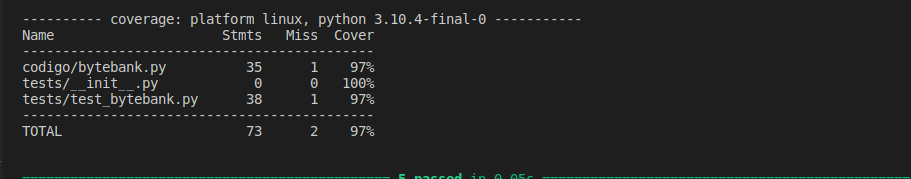
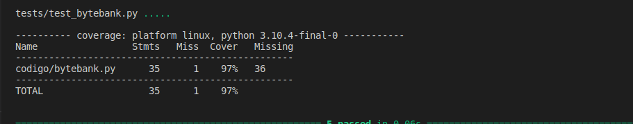

# Python e TDD

Voltar à [Página inicial](../README.md).

Neste markdown irei documentar o curso "Python e TDD: explorando testes unitários" da Alura enquanto realizo ele.

O projeto em que serão aplicados os conceitos estão nesta pasta Python_TDD. 

Para não nos perdemos entre as modificações no projeto e esta documentação, todo commmit dado será reportado aqui. A ideia é que tal documento siga o curso de forma linear. O curso ira utilizar o pycharm como editor, porém irei utilizar o vs code.

## Preparando o ambiente

Versões utilizadas

- Python: 3.10.4
- pytest: 7.1.2
- pytest-cov: 3.0.0

## Primeiros passos

Instale um ambiente virtual 
```
python3 -m venv ./venv
```
Para ativar 
```
source /home/carlos/Documentos/Apostila_Tech/Apostila_Tech/Python_TDD/venv/bin/activate
```
Para instalar os requirementos rode
```
pip3 install -r requirements.txt 
```

Aqui darei o primeiro commit com nome "primeiros passos"

## Por que testar

Crie um arquivo main.py no diretorio principal. Insira o codigo
```
from codigo.bytebank import Funcionario

lucas = Funcionario('Lucas Carvalho', '13/03/2000', 1000)

print(lucas.idade())
```

Observe que se rodarmos o main.py teremos um erro, visto que na regra de negocio estamos preparados apenas para receber o ano de nascimento. Para corrigir tal problema substitua o metodo idade por
```
def idade(self):
        data_nasciemnto_quebrada = self._data_nascimento.split('/')
        ano_nascimento = data_nasciemnto_quebrada[-1]
        ano_atual = date.today().year
        return ano_atual - int(ano_nascimento)
```
Como podemos testar nosso codigo? Voce poderia pensar em diversas possibilidades e testar da seguinte forma
```
from codigo.bytebank import Funcionario

def teste_idade():
    funcionario_teste = Funcionario('Teste', '13/03/2000', 1111)
    print(f'Teste = {funcionario_teste.idade()}')

    funcionario_teste1 = Funcionario('Teste', '13/03/1999', 1111)
    print(f'Teste = {funcionario_teste1.idade()}')

    funcionario_teste2 = Funcionario('Teste', '01/12/1999', 1111)
    print(f'Teste = {funcionario_teste2.idade()}')

teste_idade()
```
Porém será que tal forma é a melhor e mais eficiente? Para isso vamos conhecer o framework Pytest

### Pytest

Já temos instalado o pytest, além disso, voce deve criar um pasta **tests**, e dentro dela o arquivo
**__init__.py**, para que o python reconheça e entenda que é um módulo. Também, dentro de **tests**
crie o arquivo que **test_bytebank.py** será onde implementaremos os testes.

Ao implementarmos um teste você pode se perguntar, "ok, e agora como faço isso?!". Para isso existe algumas metodologias, como por exemplo a Given-When-Then, isto é, Dado(contexto) - Quando(Ação) - Então(Desfecho). Para exemplificar de forma simples:
- Given - Voce tem 100 reais e precisa de uma roupa nova4
- When - Voce realiza a compra de uma camisa no site da loja
- Then - Voce recebe a entrega da roupa nova.

Vamos seguir essa metodologia. Então em **test_bytebank.py** insira
```
from codigo.bytebank import Funcionario

class TestClass:
    def test_quando_idade_recebe_13_03_2000_deve_retornar_22(self):
        entrada = "13/03/2000" #Given-Contexto
        esperado = 22 

        funcionario_teste = Funcionario("Teste", entrada,1000)
        resultado = funcionario_teste.idade() # When - ação

        assert resultado == esperado # Then-desfecho
```
Para rodar o teste 
```
pytest -v
```
Note que o pytest já reconhece de forma automatica os testes da classe TestClass, mas  devemos sempre começar o nome do arquivo e dos metodos por **test** (test_bytebank.py e test_quando_idade_recebe_13_03_2000_deve_retornar_22). Outra ponto 
importante é devemos colocar o nome dos métodos o mais verboso possível, assim, quando rodarmos os testes podemos
identificar rapidamente qual não passou.

Nos foi pedido agora para implementar um método que retornasse o sobrenome do funcionário. Uma possível implementação para isso na classe **Funcionario** de **bytebank.py** é

```
def sobrenome(self):
        nome_completo = self.nome.strip()
        nome_quebrado = nome_completo.split(' ')
        return nome_quebrado[-1]
```

Vamos implementar um teste para tal método. Assim,
```
def test_quando_sobrenome_recebe_Lucas_Carvalho_deve_retornar_Carvalho(self):
        entrada = "Lucas Carvalho" # Given
        esperado = "Carvalho"

        funcionario_teste = Funcionario(entrada,'11/11/2000',1000)
        resultado = funcionario_teste.sobrenome() # When 

        assert resultado == esperado # then
```
Rodando vemos que o método está ok. Agora vamos pensar um pouco diferente, será que poderíamos fazer esse processo de forma invertida: gerar o teste e depois o método?

## TDD

O caminho lógico que tomamos nos exemplos anteriores foi implementar o código e posteriormente implementarmos os testes.
Existe uma escola de pensamento (Test-Driven Development (TDD) ) que dita que é interessante desenvolvermos os testes para o código antes e a implementação depois. Após desenvolvermos o código e ele passar no teste, avançamos para a refatoração.
É interessante pensar nisto como um processo contínuo, 

(Teste) ------> (Código) ------> (Refatoramos) ------> (Teste) ------> (Código) ...

É possível criar um teste apenas considerando a regra de negócio. Inclusive, essa é uma das vantagens do TDD: os testes acabam se tornando a espinha dorsal do projeto, uma base que tem ligação direta com as regras de negócio. Através deles, fica mais claro a quais regras de negócio o nosso código deve obedecer.

Seguindo este modelo vamos implementar um novo método que decresce o salário dos diretores da empresa
em 10%. Insira o seguinte teste
```
    def test_quando_decrescimo_salario_recebe_100000_deve_retornar_90000(self):
        entrada_salario = 100000 #Given
        entrada_nome = 'Paulo Bragança'
        esperado = 90000

        funcionario_teste = Funcionario(entrada_nome, '11/11/2000', entrada_salario)
        funcionario_teste.decrescimo_salario() # when
        resultado = funcionario_teste.salario

        assert resultado == esperado  # then
```

Agora, vamos implementar o método decrescimo_salario.

```
def decrescimo_salario(self):
    sobrenomes = ['Bragança', 'Windsor', 'Bourbon', 'Yamato', 'Al Saud', 'Khan', 'Tudor', 'Ptolomeu']
    if self._salario >= 100000 and (self.sobrenome() in sobrenomes):
        decrescimo = self._salario * 0.1
        self._salario -= decrescimo
```

Testando vemos que está tudo ok. No entanto estamos verificando se o funcionário é diretor, se seu salário é maior que R$100.000,00 e realizando o decréscimo de salário, são muitos processos acontecendo no mesmo método. Num cenário ideal, cada método tem uma única função. Vamos refatorar tal 
código. Crie o método

```
def _eh_socio(self):
    sobrenomes = ['Bragança', 'Windsor', 'Bourbon', 'Yamato', 'Al Saud', 'Khan', 'Tudor', 'Ptolomeu']
    return (self._salario >= 100000) and (self.sobrenome() in sobrenomes)
```

E no método decrescimo_salario faça
```
def decrescimo_salario(self):
    if _eh_socio():
        decrescimo = self._salario * 0.1
        self._salario -= decrescimo
```

Aqui realizarei mais um commit com nome "introducao ao TDD".

Uma curiosidade interessante é como podemos rodar um teste em específico. Por exemplo para rodar
o teste do método **test_quando_idade_recebe_13_03_2000_deve_retornar_22** de o comando
```
pytest -v -k idade
```
O pytest ira procurar todos os métodos que possuem idade no seu nome.

## Exceptions

Considere o método calcular_bonus, que tem como objetivo dar uma bônus de 10% do salário para funcionários que ganham até 10.000, caso o salário seja maior o funcionário nao recebe tal bônus. Vamos testá-lo com 
```
def test_quando_calcular_bonus_recebe_1000_deve_retornar_100(self):
    entrada = 1000  # given
    esperado = 100

    funcionario_teste = Funcionario('teste', '11/11/2000', entrada)
    resultado = funcionario_teste.calcular_bonus() # when

    assert resultado == esperado  # then
```

Se testarmos com entrada = 1000000 podemos ver que calcular_bonus retorna o valor 0. 
Outra forma de testarmos é utilizando uma exception, isto é, um erro personalizado.

Reescreva o método calcular_bonus bônus da seguinte forma
```
def calcular_bonus(self):
    valor = self._salario * 0.1
    if valor > 1000:
        raise Exception('O salário é muito alto para receber um bônus')
    return valor
```
Agora insira o código no arquivo main.py
```
ana = Funcionario('Ana', '12/03/1997', 100000000)

print(ana.calcular_bonus())
```
Note que ao rodarmos main.py e agora o retorno é uma exceção com a justificativa de que o salário é muito alto para receber um bônus.

A seguir, vamos construir um teste que considere a situação que o funcionário não recebe o bônus.
Devemos inserir 
```
import pytest
```
em **test_bytebank.py**. Também insira
```
def test_quando_calcular_bonus_recebe_100000000_deve_retornar_exception(self):
        with pytest.raises(Exception):
            entrada = 100000000  # given

            funconario_teste = Funcionario('teste', '11/11/2000', entrada)
            resultado = funconario_teste.calcular_bonus()  # when

            assert resultado  # then
```

Rode os testes e veja que todos passaram.

## Marks

Como vimos, conseguimos rodar teste específicos pelo nome do método, porém conforme o número de testes
cresce rodar um teste específico pelo nome não fica prático. E aí que as Marks são úteis. Mas o que são Marks?  São tags que associamos a determinados testes. Primeiro é necessário importá-los 
```
from codigo.bytebank import Funcionario
import pytest
from pytest import mark
```

Vamos supor que queremos executar apenas os testes referentes ao método calcular_bonus. Então adicione
uma mark **@mark.calcular_bonus**.
```
@mark.calcular_bonus
def test_quando_calcular_bonus_recebe_1000_deve_retornar_100(self):
    entrada = 1000  # given
    esperado = 100

    funcionario_teste = Funcionario('teste', '11/11/2000', entrada)
    resultado = funcionario_teste.calcular_bonus() # when

    assert resultado == esperado  # then


@mark.calcular_bonus
def test_quando_calcular_bonus_recebe_100000000_deve_retornar_exception(self):
    with pytest.raises(Exception):
        entrada = 100000000  # given

        funcionario_teste = Funcionario('teste', '11/11/2000', entrada)
        resultado = funcionario_teste.calcular_bonus()  # when

            assert resultado  # then
```
Agora para rodar tais testes basta dar o comando
```
pytest -v -m calcular_bonus
```
Note que é exibido dois warnings(avisos). O pytest não sabe distinguir se é um erro de digitação ou um mark personalizado.
Os marks não são apenas tags que podemos utilizar como referências para certos testes, eles têm outras utilidades e seguem alguns padrões. Para verificar quais tipos de marks existem no Pytest, vamos executar pytest --markers no terminal. Por exemplo, ao colocar `@pytest.mark.skip` antes de um teste, executaremos todos os testes e "pularemos" apenas este.

Além do `@pytest.mark.skip` que "pula" um teste, temos o `@pytest.mark.skipif` que "pulará" o teste se uma condição for obedecida. Existe também o `@pytest.mark.xfail` que determina que um teste deve falhar, caso certa condição seja atendida. São diversos markers à disposição, é interessante consultarmos a [documentação](https://docs.pytest.org/en/7.1.x/how-to/mark.html#mark) do Pytest para encontrar formas de personalizar nossos códigos conforme nossas necessidades

 Para retirar esses avisos, precisamos gerar um arquivo, onde incluiremos esses marks personalizados.
 Em Python_TDD crie um arquivo pytest.ini

 Este é um arquivo de configuração do Pytest e ele precede a configuração original do Pytest. É preciso tomar cuidado com o que colocamos nele, pois, uma vez o Pytest é executado, ele dará prioridade ao que está neste arquivo e, depois, considerará a configuração padrão do Pytest.
 Ǹeste arquivo insira
 ```
 [pytest]
markers =
    calcular_bonus: Teste para o metodo calcular_bonus
```

Agora, se rodarmos o comando 'pytest -v -m calcular_bonus' novamente não serão apresentados warnings.

Aqui iremos realizar mais um commit, com o nome "exceptions e marks".

## Cobertura

Sabemos que existem vários testes para vários segmentos do projeto, contudo não há garantia de que todas as linhas de código estão cobertas por algum teste. Quando trabalhamos com testes, a intenção é ter 100% de cobertura por testes. Claro, podemos conferir manualmente, porém em grandes projetos isto
não é razoável. Para isso o pytest tem uma extensão chamada pytest-cov. Já temos instalado o pytest-cov 3.0.0, então podemos rodar o comando 
```
pytest --cov
```
Assim, o pytest-cov procurará todos os testes para checar a cobertura. Nos será mostrado a seguinte tabela



Em  miss temos a quantidade de linhas que não estão sendo cobertas em cada arquivo. Como temos interesse apenas no arquivo **bytebank.py** podemos espeficicar isso no comando selecinando o diretório
em que queremos checar a cobertura. Assim, para selecionar o diretório codigo rode
```
pytest --cov=codigo tests/diretório
```
Como podemos saber qual parte do codigo não esta coberta? Para isso rode
```
pytest --cov=codigo tests/ --cov-report term-missing
```
ou 
```
pytest --cov=codigo tests/ --cov-report html
```
Que gerará um arquivo html reportadado mais informações sobre a cobertura de testes. 

Que tera como retorno a tabela



Há uma coluna extra denominada "Missing", que explicita a linha do código que não está coberta por testes. No caso, a linha 36 do arquivo bytebank.py.

Então podemos ver que se refere ao código
```
def __str__(self):
        return f'Funcionario({self._nome}, {self._data_nascimento}, {self._salario})'
```
Com isso, poderíamos testar o método str com 
```
def test_retorno_str(self):
    nome, data_nascimento, salario = 'Teste', '12/03/2000', 1000 # given
    esperado = 'Funcionario (Teste, 12/03/2000, 1000)'

    funcionario_teste = Funcionario (nome, data_nascimento, salario)
    resultado = funcionario_teste.__str.__() # when

    assert resultado == esperado #then
```
Porém note que tal método é uma estrtura base do python, e não deveríamos ter que testar estruturas intrínsicas do python. Em vez de criar testes para questões de linguagem, podemos informar ao coverage do Pytest que existem algumas exceções, isto é, algumas linhas no nosso código que não é preciso testar.

Dentro do diretório bytebank.tdd, criaremos um arquivo chamado .coveragerc. Assim como o pytest.ini, o .coveragerc também precederá as configurações básicas, dessa vez para a extensão do coverage do Pytest. Neste arquivo, vamos definir algumas configurações para nosso relatório (report), indicando linhas que queremos que sejam excluídas do escaneamento:
```
[report]
exclude_lines =
    def __str__
```

Novamente rodando 'pytest --cov=codigo tests/ --cov-report term-missing' temos miss = 0.

## Gerando relatórios e configurações

Como vimos sabemos que dando os comandos 'pytest --cov=codigo tests/ --cov-report term-missing' ou 
'pytest --cov=codigo tests/ --cov-report html' são duas opções de consulta sobre a cobertura de testes.
Podemos configurar os comandos anteriores. Quando damos o comando 'pytest --cov' o pytest realiza os teste em todas as pastas do nosso, tornando o comando 
 '-cov=codigo tests/' desnecessário. Ao configurar o  source, ao rodar pytest --cov, apenas o diretório codigo será compreendido. O arquivo .coveragerc deve ficar da forma 
 ```
 [run]
source = ./codigo

[report]
exclude_lines =
    def __str__
```
Também o relatório HTML é gerado numa pasta de nome htmlcov, mas gostaríamos de guardá-lo em uma pasta própria. No arquivo .coveragerc, vamos personalizar esse local de armazenamento:
```
[run]
source = ./codigo

[report]
exclude_lines =
    def __str__

[html]
directory = coverage_relatorio_html
```
No pytest.ini podemos configurar da seguinte forma
```
[pytest]
addopts = -v --cov=codigo tests/ --cov-report term-missing
markers =
    calcular_bonus: Teste para o metodo calcular_bonus
```
Assim, toda vez que executarmos pytest serão adotadas as tags -v, --cov=codigo e --cov-report term-missing. Em outras palavras, o retorno sempre será verboso, os testes sempre serão executados no diretório codigo e sempre geraremos um relatório term-missing. Outra opção seria configurar para recebermos um relatório HTML.

Outra opção seria gerar um relatório em xml ao invés de html. Para isso
```
pytest --cov-report xml
```

Daqui daremos mais um commit com nome "relatorio".