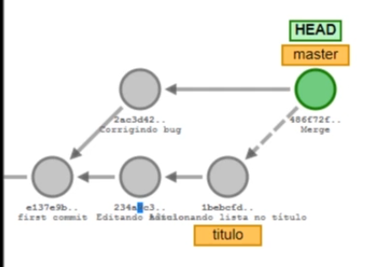
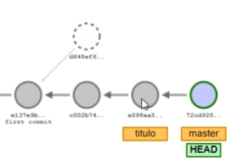
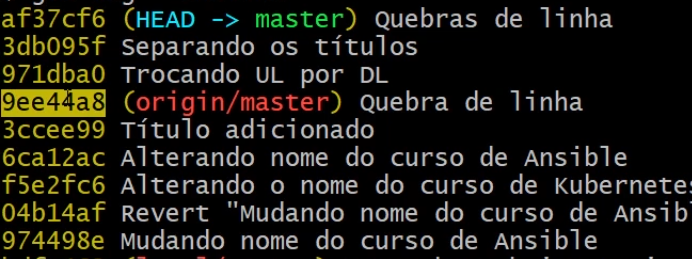

# Comandos Git/GitHub

Voltar à [Página inicial](README.md).

## Nomeclatura
- [ ] HEAD: Estado atual do nosso código, ou seja, onde o Git os colocou

- [ ] Working tree: Local onde os arquivos realmente estão sendo armazenados e editados

- [ ] index: Local onde o Git armazena o que será commitado, ou seja, o local entre a working tree e o repositório Git em si.

## Comandos Git

### Instalação do Git no Ubuntu
```
$ sudo apt-get install git-all
```

### Git init
Para inicializar um repositório  git no seu projeto digite
```
git init
```

### Git clone
Para clonar um projeto, isto é, fazer a sua primeira cópia 
```
git clone <url-do-repositorio.git>
```

### Git config
Para qualquer interação com o git, você precisa informar quem é você para que ele armazene corretamente os dados do autor de cada uma das alterações no código. Para configurar localmente
```
git config --local user.name "Seu nome aqui"
git config --local user.email "seu@email.aqui"
```
Para configurar globalmente
```
git config --global user.name "Seu nome aqui"
git config --global user.email "seu@email.aqui"
```

### Git pull
Suponha que estamos trabalhando em uma equipe que realizou mudanças no projeto, para atualizar nosso código, caso  já tenhamos clonado um projeto, ou se já estabelemos uma conexão com o comando "git remote" podemos dar o comando

```
git  pull <nome-do-repositorio> <sua-Branch>
```
que atualizará nosso projeto.
### Git add
Para adicionar arquivos que serão monitorados pelo git para "commitar"
```
git  add <nome-do-arquivo>
```
Para o git deixar de monitorar uma arquivo 
```
git  rm <nome-do-arquivo>
```

Caso queira adicionar todos os arquivos do projeto
```
git  add .
```

### .Gitignore
O git oferece uma opção para conseguirmos ignorar arquivos/pastas do nosso projeto. Para isso
crie um arquivo com o nome ".gitignore"  e adicione os arquivos/pastas que deseje que o git ignore.

### Git commit
Para commitar o projeto 
```
git  commit -m "título do commit"
```

### Git status

Para ver o estado do nosso repositório, ou seja, quais arquivos foram alterados, ou não, 
```
git status
```
Ao ser rodado,  ele nos informa em qual ramo está sendo rodado, se possui commits e 
se há arquivos não monitorados em nosso projeto. 

### Git log
Para mostrar o histórico de commits
```
git log
```
Tal comando irá mostrar o hash dos commits, com seu respectivo autor, data e título do commit. Para mostrar o histórico de commits mais resumido
```
git log --oneline
```

Para mostrar o histórico de commits mais completo (inclusive com o que foi alterado)
```
git log -p
```
Para mostrar o histórico de commits com elementos graficos
```
git log --graph
```

### Git diff
Para mostrar as deiferenças do arquivo salvo para o último commit de
```
git diff
```

### Git push
Para enviar as alterações para o repositório remoto,
```
git push <nome-do-repositorio> <sua-Branch>
```
No caso, se queremos enviar para a branch  main do GitHub podemos dar o comando "git push origin main" ou "git push -u origin main", cujo -u define que, sempre que usarmos git push e estivermos na main, o envio seja feito para origin. Ou seja, a partir de então poderemos executar simplesmente git push.

Lembre de sempre antes de dar o comando push dar o comando pull, para não ter divergências
entre o repositório local e remoto.

### Git remote
Se você não clonou nenhum repositório e deseja enviar suas alterações para um servidor remoto, precisa adicioná-lo antes com
```
git remote add <nome-que-daremos-para-o-repositorio> <servidorRemoto>
``` 
Para listar os repositórios conhecidos pelo repositório local 
```
git remote 
``` 
Também podemos mostrar qual servidor remoto estamos buscando (fetch), e enviado (push) dando o comando 
```
git remote -v
``` 
Em situações um pouco mais complexas poderíamos configurar para tais servidores serem distintos.

### Git rename
Para renomear um repositório basta digitar
```
git rename remote <nome-antigo> <nome-novo>
``` 

### Git init --bare
Em uma pasta distinta (vamos supor que seu nome seja servidor_local) do nosso projeto poderíamos criar um servidor local
```
git init --bare
``` 
Com isso ao invés de conectarmos com um repositorio do GitHub poderíamos conectar localmente com o comando "git remote add local <caminho-do-servidor_local>"

### Git restore
Para iniciar o git no seu projeto digite
```
git restore
```

### Git checkout
Para criarmos uma nova branch de o comando
```
git checkout -b <nome-da-branch>
```
Ao mesmo tempo, tal comando já muda nossa branch atual para a branch criada.

### Git switch
Para mudarmos de branch de o comando
```
git switch <nome-da-branch>
```

### Git branch
Para criar uma branch (porém sem mudar de branch) de o comando
```
git branch <nome-da-branch>
```
Para ver nossas branchs e também saber em qual estamos 
```
git branch
```
Para excluir uma branch de o comando
```
git branch -d <nome-da-branch>
```

### Git merge
Suponha que tenhamos uma branch com o nome titulo e a branch principal



para unirmos o códigos que nem na imagem, estando na branch master de o código

```
git merge titulo
```

### Git rebase
Novamente suponha que tenhamos uma branch com o nome titulo e a branch principal



para unirmos o códigos que nem na imagem, estando na branch master de o código

```
git rebase titulo
```
A diferença para o comando merge é que teremos um histórico linear de commits no rebase, primeiro colocando os commits de título e depois o da branch master. Ao contrário, no merge
os commits de titulo serão unificados em um e serão adicionados por último na branch master.

Como vimos o comando rebase pode ser usado para unir branchs, além disso, também pode ser usado para unir commits. Imagine a seguinte situação, depois
de realizar três commits você observa que eles poderiam ter sido um só. Para realizar isto podemos usar o rebase. Para selecionar os últimos n commits e 
uni-los em um de o seguinte comando

```
git rebase -i HEAD~n
```
Outra forma seria selecionar o commit imediatamente anterior ao primeiro com o qual queremos trabalhar, acrescentando-o ao fim do comando git rebase -i.
Por exemplo, se temos os seguintes commits 


e queremos selecionar os três últimos commits, de o comando
```
git rebase -i 9ee44a8
```
Ao executarmos, receberemos a lista dos commits que queremos analisar. Será mostrado o commit mais antigo para o mais novo, de cima para baixo, e informaremos, no commit desejado, que queremos unificar tal commit com o commit anterior trocando pick por s. Por fim, podemos redefinir a mensagem para este commit unificado.
### Como é o CTRL+Z no Git?
Caso você queria restaurar um arquivo até o seu último commit
 ```
git checkout -- <nome-do-arquivo>
```
Caso você já tenha feito "git add <nome-do-arquivo>" para retirar tal arquivo das mudanças a serem submetidas
 ```
git reset HEAD comandos_git.md
```
Caso você ja tenha feito o commit e queria reverte-lo para o anterior( na realidade o git criara outro commit em que retira as alterações do commit )
 ```
git revert <Hash-do-commit>
```

### Salvando para depois
Imagine que fez algumas modificações em uma parte do codigo e não terminou. Caso voce não queira perder tais alterações porém também não quer commita-las de o comando
 ```
git stash
```
que ira salvar as alterações realizadas em relação ao último commit. Para mostrar as listas de stash dados
 ```
git stash list
```
Imagine que você fez outras alterações e fez um commit. Para recuperar as alterações que você salvou ao fazer "git stash" de o comando
 ```
git stash apply <numero-da-stash>
```
O <numero-da-stash> pode ser visto em "git stash list". Note que após "git stash apply <numero-da-stash>" tal stash continua salvo, para elminar ele da lista de
```
git stash drop <numero-da-stash>
```
ou 
```
git stash pop <numero-da-stash>
```
pra recuperar as alterações e já elimminar ela da lista de stashs.

### Viajando no tempo
Como podemos voltar o código a um commit específico? Para isso de o comando
```
git checkout <Hash-do-commit>
```
Note que após esse comando a branch que estamos fica como detached, isto é, não estamos em nehuma branch. Para "recuperar" o código do commit selecionado também de o comando
```
git checkout -b <nova-branch>
```
que ira criar uma branch com o código do commit com o hash <Hash-do-commit>. 

### Tags e Releases 
Podemos criar uma tag, isto é, um marco no projeto dando o comando
```
git tag -a <nome-dado-a-tag> -m "<mensagem>"
```
Como por exemplo 
```
git tag -a v0.1.0 -m "Primeira versão (BETA) do curso"
```
Para ver as tags disponíveis
```
git tag
```
Assim como fizemos git push para um repositorio remoto de uma branch também podemos fazer para uma tag com
```
git push <nome-do-repositorio> <nome-dado-a-tag>
```
como por exemplo 
```
git push origin v0.1.0
```
ou
```
git push local v0.1.0
```
O GitHub tem um tratamento especial para as tags que enviarmos.

## GitHub

- [ ] Em construção
